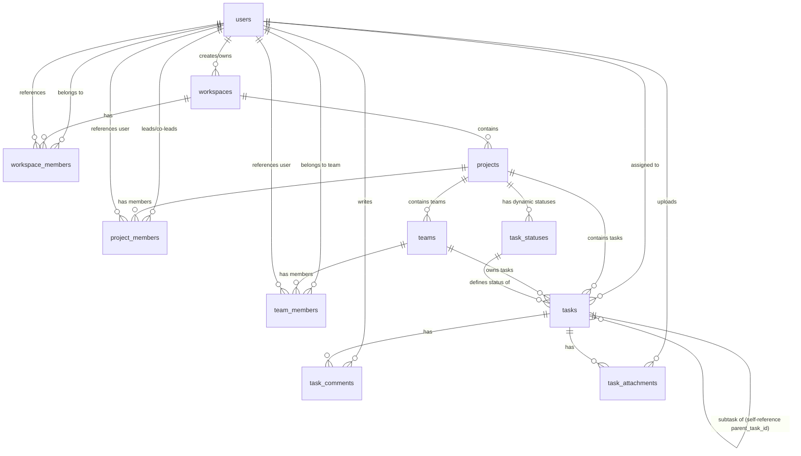

# Desain Basis Data: EventSync Pro

Dokumen ini menjelaskan struktur data konseptual, hubungan antar-entitas, serta detail rancangan tabel basis data relasional untuk sistem **EventSync Pro** menggunakan **PostgreSQL**.

---

## 1. Entity-Relationship Diagram (ERD)

Berikut adalah diagram relasi entitas dalam sistem EventSync Pro yang disajikan dalam format **Mermaid.js**:

---

## 2. Kamus Data & Spesifikasi Tabel (Data Dictionary)

Berikut adalah deskripsi rinci dari masing-masing tabel yang akan diimplementasikan di basis data PostgreSQL.

### 2.1. Tabel `users`
Menyimpan informasi utama akun pengguna aplikasi di tingkat global.

| Nama Kolom | Tipe Data | Constraint | Keterangan |
| :--- | :--- | :--- | :--- |
| `id` | UUID | PRIMARY KEY, DEFAULT gen_random_uuid() | ID unik pengguna |
| `email` | VARCHAR(255) | UNIQUE, NOT NULL | Alamat email (untuk login) |
| `password_hash` | VARCHAR(255) | NOT NULL | Password terenkripsi (hashing bcrypt/argon2) |
| `username` | VARCHAR(50) | UNIQUE, NOT NULL | Username unik untuk mention (@username) |
| `full_name` | VARCHAR(100) | NOT NULL | Nama lengkap pengguna |
| `avatar_url` | VARCHAR(500) | NULL | URL foto profil/avatar pengguna |
| `role_global` | VARCHAR(20) | NOT NULL, DEFAULT 'user' | Peran tingkat aplikasi (`owner_apps`, `user`) |
| `created_at` | TIMESTAMP | DEFAULT CURRENT_TIMESTAMP | Waktu pendaftaran akun |
| `updated_at` | TIMESTAMP | DEFAULT CURRENT_TIMESTAMP | Waktu pembaruan akun terakhir |

### 2.2. Tabel `workspaces`
Menyimpan data ruang kerja (workspace) yang bertindak sebagai kontainer tingkat teratas.

| Nama Kolom | Tipe Data | Constraint | Keterangan |
| :--- | :--- | :--- | :--- |
| `id` | UUID | PRIMARY KEY, DEFAULT gen_random_uuid() | ID unik workspace |
| `name` | VARCHAR(100) | NOT NULL | Nama ruang kerja |
| `description` | TEXT | NULL | Penjelasan mengenai workspace |
| `logo_url` | VARCHAR(500) | NULL | URL logo workspace |
| `owner_id` | UUID | FOREIGN KEY -> `users(id)`, ON DELETE RESTRICT | Pengguna yang membuat workspace |
| `created_at` | TIMESTAMP | DEFAULT CURRENT_TIMESTAMP | Waktu pembuatan |
| `updated_at` | TIMESTAMP | DEFAULT CURRENT_TIMESTAMP | Waktu pembaruan terakhir |

### 2.3. Tabel `workspace_members`
Menghubungkan user dengan workspace dan mendefinisikan peran lokal mereka di dalam workspace tersebut.

| Nama Kolom | Tipe Data | Constraint | Keterangan |
| :--- | :--- | :--- | :--- |
| `id` | UUID | PRIMARY KEY, DEFAULT gen_random_uuid() | ID unik keanggotaan |
| `workspace_id` | UUID | FOREIGN KEY -> `workspaces(id)`, ON DELETE CASCADE | ID Workspace tujuan |
| `user_id` | UUID | FOREIGN KEY -> `users(id)`, ON DELETE CASCADE | ID User terundang |
| `role_workspace`| VARCHAR(20) | NOT NULL, DEFAULT 'member' | Peran lokal (`owner`, `admin`, `member`) |
| `status_invitation`| VARCHAR(20) | NOT NULL, DEFAULT 'accepted' | Status undangan (`pending`, `accepted`, `expired`) |
| `joined_at` | TIMESTAMP | DEFAULT CURRENT_TIMESTAMP | Waktu bergabung/diundang |

*Kombinasi unik:* `(workspace_id, user_id)` harus bersifat **UNIQUE** untuk menghindari duplikasi keanggotaan.

### 2.4. Tabel `projects`
Menampung data proyek di dalam workspace.

| Nama Kolom | Tipe Data | Constraint | Keterangan |
| :--- | :--- | :--- | :--- |
| `id` | UUID | PRIMARY KEY, DEFAULT gen_random_uuid() | ID unik proyek |
| `workspace_id` | UUID | FOREIGN KEY -> `workspaces(id)`, ON DELETE CASCADE | Workspace tempat proyek berada |
| `name` | VARCHAR(100) | NOT NULL | Nama proyek |
| `description` | TEXT | NULL | Detail ringkasan proyek |
| `created_by` | UUID | FOREIGN KEY -> `users(id)`, ON DELETE SET NULL | Pembuat pertama proyek |
| `created_at` | TIMESTAMP | DEFAULT CURRENT_TIMESTAMP | Waktu proyek dibuat |
| `updated_at` | TIMESTAMP | DEFAULT CURRENT_TIMESTAMP | Waktu edit terakhir |

### 2.5. Tabel `project_members`
Mengatur daftar pengguna yang memiliki wewenang khusus di tingkat Project (Project Leader & Co-Leader).

| Nama Kolom | Tipe Data | Constraint | Keterangan |
| :--- | :--- | :--- | :--- |
| `id` | UUID | PRIMARY KEY, DEFAULT gen_random_uuid() | ID unik relasi |
| `project_id` | UUID | FOREIGN KEY -> `projects(id)`, ON DELETE CASCADE | ID Proyek terkait |
| `user_id` | UUID | FOREIGN KEY -> `users(id)`, ON DELETE CASCADE | ID Pengguna |
| `role_project` | VARCHAR(20) | NOT NULL | Peran proyek (`leader`, `co_leader`) |
| `joined_at` | TIMESTAMP | DEFAULT CURRENT_TIMESTAMP | Tanggal penugasan peran proyek |

*Kombinasi unik:* `(project_id, user_id)` harus bersifat **UNIQUE**.

### 2.6. Tabel `teams`
Menyimpan data tim pelaksana yang dibentuk di bawah Project tertentu.

| Nama Kolom | Tipe Data | Constraint | Keterangan |
| :--- | :--- | :--- | :--- |
| `id` | UUID | PRIMARY KEY, DEFAULT gen_random_uuid() | ID unik tim |
| `project_id` | UUID | FOREIGN KEY -> `projects(id)`, ON DELETE CASCADE | Proyek tempat tim bernaung |
| `name` | VARCHAR(100) | NOT NULL | Nama tim (misal: "Team Frontend") |
| `description` | TEXT | NULL | Deskripsi divisi/tim |
| `created_at` | TIMESTAMP | DEFAULT CURRENT_TIMESTAMP | Waktu pembuatan tim |
| `updated_at` | TIMESTAMP | DEFAULT CURRENT_TIMESTAMP | Waktu pembaruan terakhir |

### 2.7. Tabel `team_members`
Menghubungkan pengguna sebagai anggota dari suatu Team di dalam Project, beserta perannya di tim tersebut.

| Nama Kolom | Tipe Data | Constraint | Keterangan |
| :--- | :--- | :--- | :--- |
| `id` | UUID | PRIMARY KEY, DEFAULT gen_random_uuid() | ID unik relasi |
| `team_id` | UUID | FOREIGN KEY -> `teams(id)`, ON DELETE CASCADE | ID Tim |
| `user_id` | UUID | FOREIGN KEY -> `users(id)`, ON DELETE CASCADE | ID User anggota tim |
| `role_team` | VARCHAR(20) | NOT NULL, DEFAULT 'member' | Peran tim (`leader`, `co_leader`, `member`) |
| `joined_at` | TIMESTAMP | DEFAULT CURRENT_TIMESTAMP | Tanggal user masuk tim |

*Kombinasi unik:* `(team_id, user_id)` harus bersifat **UNIQUE**.

### 2.8. Tabel `task_statuses`
Menyimpan kolom status Kanban dinamis per-Project.

| Nama Kolom | Tipe Data | Constraint | Keterangan |
| :--- | :--- | :--- | :--- |
| `id` | UUID | PRIMARY KEY, DEFAULT gen_random_uuid() | ID unik status |
| `project_id` | UUID | FOREIGN KEY -> `projects(id)`, ON DELETE CASCADE | Proyek pemilik status |
| `name` | VARCHAR(50) | NOT NULL | Nama status (misal: "To Do", "In QA") |
| `color_hex` | VARCHAR(7) | DEFAULT '#9E9E9E' | Kode warna hex untuk label visual status |
| `position` | INT | NOT NULL | Urutan urut kolom di papan Kanban (1, 2, dst.) |
| `created_at` | TIMESTAMP | DEFAULT CURRENT_TIMESTAMP | Tanggal status dibuat |
| `updated_at` | TIMESTAMP | DEFAULT CURRENT_TIMESTAMP | Tanggal pembaruan status |

*Kombinasi unik:* `(project_id, position)` harus unik untuk menghindari tabrakan urutan urut kolom status.

### 2.9. Tabel `tasks`
Menyimpan tugas (Task) dan sub-tugas (Subtask) secara berjenjang. Setiap tugas wajib dikaitkan dengan tepat satu Team yang bertugas mengerjakannya.

| Nama Kolom | Tipe Data | Constraint | Keterangan |
| :--- | :--- | :--- | :--- |
| `id` | UUID | PRIMARY KEY, DEFAULT gen_random_uuid() | ID unik tugas |
| `project_id` | UUID | FOREIGN KEY -> `projects(id)`, ON DELETE CASCADE | ID Proyek tujuan |
| `team_id` | UUID | FOREIGN KEY -> `teams(id)`, ON DELETE CASCADE | ID Tim pelaksana yang memiliki akses ke Task ini |
| `status_id` | UUID | FOREIGN KEY -> `task_statuses(id)`, ON DELETE RESTRICT | ID Status Kanban saat ini |
| `title` | VARCHAR(255) | NOT NULL | Judul tugas |
| `description` | TEXT | NULL | Deskripsi detail isi tugas |
| `start_date` | TIMESTAMP | NULL | Tanggal mulai |
| `due_date` | TIMESTAMP | NULL | Batas waktu penyelesaian |
| `priority` | task_priority (ENUM) | DEFAULT 'medium' | Tingkat kepentingan (`low`, `medium`, `high`) |
| `assignee_id` | UUID | FOREIGN KEY -> `users(id)`, ON DELETE SET NULL, NULL | User pelaksana tugas individual (harus anggota dari tim terkait) |
| `parent_task_id`| UUID | FOREIGN KEY -> `tasks(id)`, ON DELETE CASCADE, NULL | ID Tugas induk jika ini adalah Subtask |
| `created_by` | UUID | FOREIGN KEY -> `users(id)`, ON DELETE SET NULL | Pembuat tugas pertama kali |
| `created_at` | TIMESTAMP | DEFAULT CURRENT_TIMESTAMP | Waktu pencatatan tugas |
| `updated_at` | TIMESTAMP | DEFAULT CURRENT_TIMESTAMP | Waktu perubahan terakhir |

### 2.10. Tabel `task_comments`
Menampung diskusi tim di dalam masing-masing Task.

| Nama Kolom | Tipe Data | Constraint | Keterangan |
| :--- | :--- | :--- | :--- |
| `id` | UUID | PRIMARY KEY, DEFAULT gen_random_uuid() | ID komentar |
| `task_id` | UUID | FOREIGN KEY -> `tasks(id)`, ON DELETE CASCADE | ID Task yang dikomentari |
| `user_id` | UUID | FOREIGN KEY -> `users(id)`, ON DELETE CASCADE | Penulis komentar |
| `comment_text` | TEXT | NOT NULL | Isi komentar diskusi |
| `created_at` | TIMESTAMP | DEFAULT CURRENT_TIMESTAMP | Waktu pengiriman komentar |

### 2.11. Tabel `task_attachments`
Menampung dokumen atau file yang diunggah di dalam sebuah Task.

| Nama Kolom | Tipe Data | Constraint | Keterangan |
| :--- | :--- | :--- | :--- |
| `id` | UUID | PRIMARY KEY, DEFAULT gen_random_uuid() | ID lampiran |
| `task_id` | UUID | FOREIGN KEY -> `tasks(id)`, ON DELETE CASCADE | ID Task terkait |
| `file_name` | VARCHAR(255) | NOT NULL | Nama asli berkas (misal: "laporan.pdf") |
| `file_url` | VARCHAR(500) | NOT NULL | Link file hosting (S3/Cloudinary) |
| `file_size` | INT | NOT NULL | Ukuran berkas dalam byte |
| `mime_type` | VARCHAR(100) | NOT NULL | Jenis MIME berkas (misal: "image/png") |
| `uploaded_by` | UUID | FOREIGN KEY -> `users(id)`, ON DELETE SET NULL | Pengunggah berkas |
| `uploaded_at` | TIMESTAMP | DEFAULT CURRENT_TIMESTAMP | Waktu unggah berkas |

---

## 3. Pemetaan Eloquent ORM Relationships (Laravel)

Untuk memudahkan pengembangan backend, berikut adalah pemetaan relasi model Eloquent Laravel berdasarkan skema PostgreSQL:

### 3.1. Model `User`
- `workspaces()`: `hasMany(Workspace::class, 'owner_id')` (Workspace yang dimiliki)
- `joinedWorkspaces()`: `belongsToMany(Workspace::class, 'workspace_members')->withPivot('role_workspace', 'status_invitation')`
- `projects()`: `belongsToMany(Project::class, 'project_members')->withPivot('role_project')`
- `teams()`: `belongsToMany(Team::class, 'team_members')->withPivot('role_team')`
- `assignedTasks()`: `hasMany(Task::class, 'assignee_id')`

### 3.2. Model `Workspace`
- `owner()`: `belongsTo(User::class, 'owner_id')`
- `members()`: `belongsToMany(User::class, 'workspace_members')->withPivot('role_workspace', 'status_invitation')`
- `projects()`: `hasMany(Project::class)`

### 3.3. Model `Project`
- `workspace()`: `belongsTo(Workspace::class)`
- `members()`: `belongsToMany(User::class, 'project_members')->withPivot('role_project')`
- `teams()`: `hasMany(Team::class)`
- `statuses()`: `hasMany(TaskStatus::class)`
- `tasks()`: `hasMany(Task::class)`

### 3.4. Model `Team`
- `project()`: `belongsTo(Project::class)`
- `members()`: `belongsToMany(User::class, 'team_members')->withPivot('role_team')`
- `tasks()`: `hasMany(Task::class)`

### 3.5. Model `Task`
- `project()`: `belongsTo(Project::class)`
- `team()`: `belongsTo(Team::class)`
- `status()`: `belongsTo(TaskStatus::class)`
- `assignee()`: `belongsTo(User::class, 'assignee_id')`
- `parent()`: `belongsTo(Task::class, 'parent_task_id')`
- `subtasks()`: `hasMany(Task::class, 'parent_task_id')` (Self-referencing relationship)
- `comments()`: `hasMany(TaskComment::class)`
- `attachments()`: `hasMany(TaskAttachment::class)`

