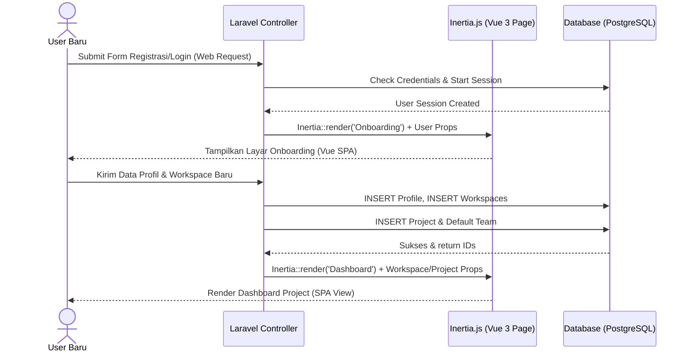

# Analisis Sistem: EventSync Pro

EventSync Pro adalah sistem informasi manajemen tugas dan ruang kerja (workspace management) kolaboratif yang terinspirasi oleh konsep keluwesan Notion dan kejelasan Kanban Board. Sistem ini dibangun dengan pendekatan arsitektur **Monolith Modern** untuk performa yang optimal, integrasi yang erat, serta siklus pengembangan yang cepat.

---

## Spesifikasi Tech Stack (Teknologi Utama)

Untuk mendukung kebutuhan fungsional dan non-fungsional MVP, sistem menggunakan tumpukan teknologi berikut:
- **Backend (BE)**: **Laravel 12+** menggunakan arsitektur **Service-Repository Pattern** berbasis Interface/Contracts untuk kode yang bersih, modular, dan mudah diuji (*mock testing*).
- **Frontend (FE)**: **Vue 3** menggunakan pendekatan **Feature-Based Component Architecture** untuk merapikan modul kode per-fitur bisnis.
- **Integrasi Monolith**: **Inertia.js** bertindak sebagai jembatan dinamis. Frontend Vue bertindak sebagai Single Page Application (SPA) tanpa memerlukan pembuatan REST API terpisah secara manual.
- **Real-time Engine**: **Laravel Reverb** sebagai WebSocket server bawaan untuk sinkronisasi instan state Kanban Board lintas pengguna dan pengiriman notifikasi real-time.
- **UI System & Animasi**: **shadcn-vue** (berbasis Tailwind CSS) untuk konsistensi komponen UI premium, serta **Motion JS** untuk animasi mikro transisi drag-and-drop kartu tugas.
- **Basis Data**: **PostgreSQL** sebagai database relasional untuk menjaga integritas relasional tingkat tinggi.

---

## 1. Peran Pengguna (User Roles)

Sistem ini menerapkan model peran bertingkat: tingkat Aplikasi (Global), tingkat Workspace, tingkat Project, dan tingkat Team.

### A. Tingkat Aplikasi (Global)
1. **Owner Apps (Global Admin/Platform Owner)**
   - Memiliki akses penuh ke panel admin pusat.
   - Dapat mengelola data seluruh pengguna terdaftar (blokir, verifikasi, ubah role).
   - Dapat memantau seluruh Workspace aktif dan statistik global.
2. **User Biasa (Regular User)**
   - Dapat melakukan registrasi mandiri, membuat Workspace baru, atau bergabung ke Workspace lain melalui tautan undangan.

### B. Tingkat Workspace (Lokal Workspace)
1. **Workspace Owner**: Pencipta Workspace. Memiliki hak penuh atas konfigurasi Workspace dan mengelola admin/member di dalamnya.
2. **Workspace Admin**: Membantu Owner mengelola anggota dan mengedit struktur Project di dalam Workspace.
3. **Workspace Member**: Anggota umum Workspace yang berkolaborasi dalam Project dan Team.

### C. Tingkat Project (Akses Lintas Tim)
Didefinisikan di dalam tiap Project untuk memantau pengerjaan secara makro:
1. **Project Leader**:
   - Memiliki hak penuh atas konfigurasi Project dan pembentukan Team di bawah Project tersebut.
   - Memiliki akses untuk membaca, membuat, memperbarui, dan menghapus data Task milik **semua Team** di dalam Project tersebut.
2. **Project Co-Leader**:
   - Membantu Project Leader dalam koordinasi taktis.
   - Memiliki hak akses penuh ke data Task milik **semua Team** di dalam Project tersebut.

### D. Tingkat Team (Akses Terisolasi)
Didefinisikan secara khusus untuk masing-masing Team di bawah Project:
1. **Team Leader**: Memimpin operasional satu Team. Mengelola anggota tim dan memiliki akses penuh ke seluruh data Task milik **timnya saja**.
2. **Co-Team Leader**: Membantu memimpin operasional tim dan memiliki akses ke data Task milik **timnya saja**.
3. **Team Member**: Anggota tim pelaksana. Hanya dapat mengakses dan berkolaborasi pada data Task milik **timnya saja**.

---

## 2. Kebutuhan Fungsional (Functional Requirements)

Berdasarkan kesepakatan MVP, berikut adalah rincian fungsionalitas sistem:

### FR-01: Autentikasi & Registrasi (Login)
- Sistem harus dapat melakukan registrasi pengguna baru dan mengautentikasi pengguna menggunakan Email dan Password (menggunakan session-cookie bawaan Laravel Laravel Session).

### FR-02: Onboarding Pengguna Baru
- Pengguna baru melengkapi profil, lalu membuat Workspace pertama (atau bergabung melalui undangan), dan otomatis dibuatkan Project template pertamanya.

### FR-03: Manajemen Workspace (Working Space Management)
- Pengguna dapat membuat beberapa Workspace, mengelola pengaturannya, atau berpindah antar-Workspace melalui dropdown navigasi.

### FR-04: Manajemen Tim (Team Management)
- **Struktur Kepemilikan**: Satu Project dapat menampung beberapa **Team** khusus (misal: *Team Frontend, Team Backend* di bawah Project *Redesign Portal*).
- Setiap Team di bawah Project memiliki struktur peran internal: **Team Leader**, **Co-Team Leader**, dan **Member**.
- Anggota Workspace dapat diundang ke satu atau beberapa Team oleh Project Leader atau Team Leader.
- **Isolasi Data**: Anggota Team (Leader, Co-Leader, Member) hanya dapat mengakses data tugas (Task) milik Team mereka sendiri.

### FR-05: Manajemen Proyek (Project Management)
- Pengguna dapat membuat **Project** di dalam Workspace.
- Pembuat Project otomatis terdaftar sebagai **Project Leader** pertama dan dapat menunjuk pengguna lain sebagai **Project Co-Leader** melalui daftar keanggotaan Project (`project_members`).
- Project Leader dapat membuat beberapa Team di dalam Project untuk membagi beban kerja.

### FR-06: Manajemen Tugas (Task Management)
- Setiap **Task** dibuat di bawah Project dan **wajib dikaitkan dengan satu Team** tertentu di dalam Project tersebut (`tasks.team_id`).
- **Aturan Otorisasi Task**:
  - Hanya Project Leader, Project Co-Leader, dan anggota Team yang dikaitkan dengan Task tersebut yang dapat melihat detail, memindahkan status, atau mengedit Task tersebut.
- **Pengelolaan Status Dinamis**: Kolom status Kanban dikonfigurasi per-Project (misal: *To Do, In Progress, Done*).
- **Subtasks (Task Bersarang)**: Mendukung relasi induk-anak di tingkat tugas untuk tim yang sama.
- **Komentar & Lampiran**: Anggota yang memiliki akses ke Task dapat menambahkan komentar diskusi dan mengunggah dokumen (maksimal 5MB).

---

## 3. Kebutuhan Non-Fungsional (Non-Functional Requirements)

### NFR-01: Performa & Efisiensi (Performance)
- Kueri Kanban board harus dibatasi dengan klausa filter peran user. Jika user adalah Team Member/Leader, query menyertakan filter `team_id`. Jika Project Leader/Co-Leader, filter `team_id` dilewati agar seluruh task ter-query. Response query harus di bawah 200 ms menggunakan index yang tepat pada `tasks(project_id, team_id, status_id)`.

### NFR-02: Keamanan & Integritas Data (Security & Integrity)
- Enkripsi password menggunakan `bcrypt` / `argon2`.
- Otentikasi dan sesi dilindungi oleh **Session Cookie** terenkripsi bawaan Laravel + **CSRF Protection** (Session Stateful via Web Routes) yang didukung penuh oleh Inertia.js untuk mencegah Session Hijacking.
- Penerapan integritas database relasional (PostgreSQL constraints) untuk memastikan tidak ada Task yang tidak dikaitkan dengan Team di bawah Project yang sama.

### NFR-03: Skalabilitas (Scalability)
- Pemisahan data terisolasi secara logis pada database untuk memudahkan audit keamanan akses data di masa depan.

---

## 4. Alur Kerja Utama (Use Case Diagram Description)

### Use Case: Onboarding & Workspace Setup

### Use Case: Pembatasan Akses Data Task
1. **User A** adalah `Team Member` dari **Team Frontend** di **Project Portal**.
2. **User B** adalah `Team Member` dari **Team Backend** di **Project Portal**.
3. **User C** adalah `Project Leader` dari **Project Portal**.
4. Saat **User A** memuat Kanban Board, server mendeteksi perannya sebagai Team Member Frontend dan **hanya mengembalikan Task** dengan `team_id` milik Team Frontend.
5. Saat **User B** memuat Kanban Board, server **hanya mengembalikan Task** milik Team Backend.
6. Saat **User C** memuat Kanban Board, server mendeteksi perannya sebagai Project Leader dan **mengembalikan seluruh Task** milik Team Frontend dan Backend.

